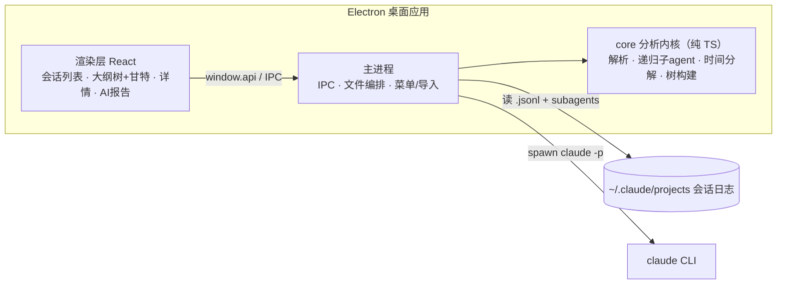
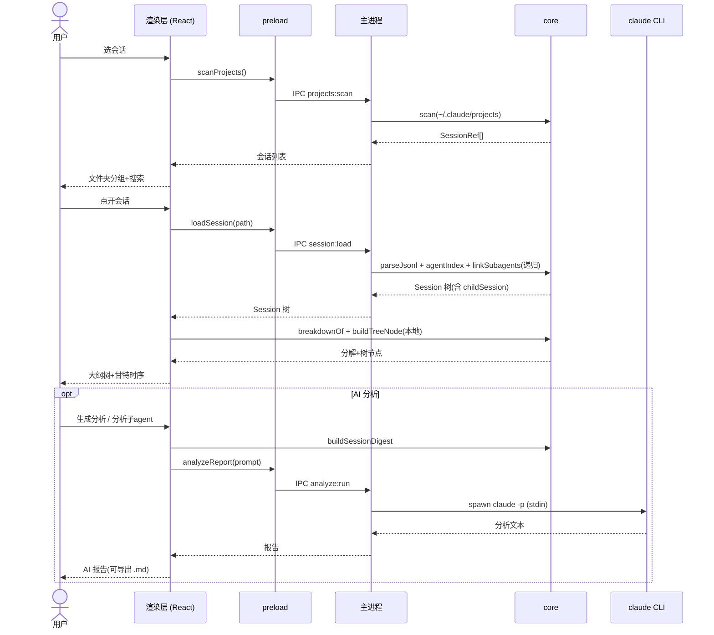

# Claude Code 会话耗时分析工具 · 方案设计

## Context（背景与目标）

**问题**：日常前后端编码中，Claude Code 会话动辄数小时，但"时间花在哪了、卡在哪个环节"看不清——现有工具要么只算 token/钱（ccusage、CodeBurn），要么只看单会话事件（ClaudeScope 看不到子 agent），要么只做摘要频次（CSD）。没有工具能回答"这次编码会话，算力 / 本地工具 / 等用户 / 子 agent 各占多少，真正的瓶颈在哪"。

**已完成的调研**（`D:\project\cc-session-analysis-tool\调研\`）已系统验证：Task/Tool/Subagent 三个维度的耗时数据**全部在本机日志里、无需埋点**，且有多个可用时间源。已有一个可运行原型 `C:\Users\jlc\claude-tools\analyze-session.js`（Node 零依赖）验证了主干可行性。

**本方案目标**：构建一个 **Win + Mac 双端通用的 Electron 桌面应用**，以**单会话深钻**为核心，用**递归"工作 vs 等待"时间分解**还原会话耗时，定位具体堵塞点。

**预期成果**：打开任一会话即可看到一棵"耗时比例树"——算力 / 本地工具(直接 + 委派子 agent) / 等用户——并能下钻到每个子 agent 的内部步骤，一眼看出是"模型在想"、是"某个 Bash/子 agent 卡住"、还是"人离开了"。

---

## 1. 已确认的需求决策

| 维度 | 决策 |
|------|------|
| 交付形态 | **Electron 桌面 GUI 应用**（electron-builder 出 Win/Mac） |
| 分析场景 | **单会话深钻为主**；会话/项目列表仅作入口 |
| 时间模型 | **递归"工作 vs 等待"分解**（见 §5） |
| 主可视化 | **大纲树 + 耗时比例条**，点击节点 → 下方详情面板 |
| Task 维度 | **v1 不做**（一波流开发不用 Task；TaskCreate/Update 无时间字段，归因成本高） |
| 成本 / prompt 归因 | **v2** |

---

## 2. 技术栈

| 层 | 选型 | 理由 |
|----|------|------|
| 运行时 | Electron（主进程 Node + 渲染 Chromium） | 与原型同栈，解析层可直接复用；双端分发成熟 |
| 语言 | TypeScript 全栈 | 类型安全；dataclass → interface 翻译直接 |
| 解析内核 | 纯 TS，**零 UI 依赖** | 主进程与未来 CLI 共用；可独立单测 |
| UI 框架 | React | 生态成熟；大纲树/详情面板标准组件 |
| 树视图 | **自绘**（DOM/CSS 比例条 + 展开折叠） | 无需重型图表库；大纲树不需要 Plotly |
| 打包 | electron-builder | Win: NSIS `.exe`；Mac: `.dmg` |

> 不复用任何 Python 代码（本机无 Python），属**重写**。UI 框架若你更熟 Vue 可平替，核心不受影响。

---

## 3. 架构与模块（绿色地带，全新创建）

### 3.1 组件图



> core 为纯 TS 内核：主进程调其解析/发现（读日志、带 fs），渲染层直接 import 其时间分解/树构建（纯模块、无 fs）。

### 3.2 时序图



---

## 4. 数据模型（递归 Session 树）

ClaudeScope 的扁平 Turn 树，加两个字段（`structuredResult` + `childSession`）即升级为可承载子 agent ��结构化结果的完整模型。

```ts
interface Session {
  sessionId: string
  cwd: string | null                // 首见值
  isSubagent: boolean               // 子 agent transcript 标记（解析时定）→ 不计等用户
  startedAt: number | null; endedAt: number | null  // ms epoch（首/尾 timestamp，含 system 事件）
  turns: Turn[]
  // 诊断
  sidechainMsgs: AssistantMsg[]; unmatchedToolUses: ContentBlock[]
  systemTurnDurationsMs: number[]; skippedCounts: Record<string, number>; parseWarnings: string[]
}

interface Turn { index: number; userMsg: UserMsg | null; assistantMsgs: AssistantMsg[]; toolCalls: ToolCall[] }

interface ToolCall {
  toolUseId: string; name: string; input: Record<string, unknown>
  tsStart: number; tsEnd: number | null; durationMs: number | null  // tsEnd-tsStart
  isError: boolean; resultTruncated: boolean
  structuredResult: StructuredResult | null   // 顶层 toolUseResult 按工具名特化
  childSession?: Session                       // 仅 Agent 调用，递归
  // kind 由 classifyTool(name) 计算（不存储）：direct / delegated / wait-user
}

interface NodeTime {
  wallMs: number                    // endedAt - startedAt
  waitUserMs: number                // 真空闲 = (轮间间隙+AskUserQuestion) − 本地工具覆盖（方案A）
  localToolMs: number               // merged(direct ∪ delegated)
  directMs: number; delegatedMs: number
  computeMs: number                 // LLM(think+output) = 补集并集（wall − 等用户 − 本地工具覆盖）
}
```

`StructuredResult` 按工具名分型：Bash(`stdout/stderr/interrupted`)、Edit(`oldString/newString/structuredPatch`)、Agent(`agentId/agentType/totalDurationMs/totalTokens`) 等。

---

## 5. 核心分析逻辑：递归"工作 vs 等待"时间分解

**节点（会话 / 子 agent）的墙钟时间分解**（与用户共同敲定）：

```
├─ 等用户 wait-user     ← 真空闲 = (轮间间隙 + AskUserQuestion) 减去与本地工具重叠的部分
├─ 本地工具 local tools ← 时间线合并（区间并集）
│  ├─ 直接工具          ← Bash / other（other = 除 Bash/AskUserQuestion/Agent 外）
│  └─ 委派 Agent ★     ← 子 agent 实际墙钟（异步后台 agent 的真实运行时长）；点开 = 子节点递归
└─ LLM(think+output)    ← 墙钟 − (等用户 ∪ 本地工具) 的补集

   方案A：墙钟一维，每一秒只归一类（优先级 本地工具 > 等用户）→ sum 严格 = 墙钟。
   ✗ turn_duration：实测 Σ 会超墙钟、不可靠 → 不用、不展示。
```

**关键规则**：
- **墙钟 = 等用户 + 本地工具 + LLM**（方案A 保证恒等对账、无重叠）。
- **等用户 = (轮间间隙 + AskUserQuestion) − 本地工具覆盖 = 真空闲**：轮间间隙 = turn N+1 用户输入 ts − turn N 最后活动 ts（不设阈值）。"人离开但后台 agent 在跑"的时间归委派（不算空闲）。子 agent 不与人交互 → 等用户恒 0。
- **委派 Agent = 子 agent 实际墙钟** `[child.startedAt, child.endedAt]`（异步后台 agent 真实运行时长，非父侧 4-6s 启动确认；同步 agent 两者相等）；点开下钻 = `childSession` 同款分解。
- **并行用时间线合并**：区间并集（union）非求和，规避"并行虚高"。
- **LLM = 补集**：墙钟 − (等用户 ∪ 本地工具)；= 模型思考+输出 + 不可剥离的间隙。

> ~~P3 待实测~~ 已实测：`turn_duration` Σ 会超墙钟（44h>33h，单轮可达 23.7h）、子 agent transcript 里恒为 0 → 不可靠，**弃用、不展示**；LLM 改为补集派生。
> **方案A 缘起**：异步后台 agent 与主线程时间线并行重叠，曾导致"等用户+委派"双算、sum > 墙钟（实测 154m > 111m）。改为优先级归属（本地工具 > 等用户）后 sum 严格 = 墙钟。

---

## 6. UI 设计（大纲树 + 耗时比例条）

**布局**：左侧会话/项目列表 → 主区为**可上下拖动分隔的二分屏**（内容随窗口大小自适应）：**上屏 = 大纲树 + 原始详情**（点节点→树下显示详情）；**下屏 = AI 分析报告**（调 `claude` 生成）。

```
┌ 会话列表 ┐┌─────────────────────────────┐
│ projA   ││ 大纲树               〔上屏〕│
│ ▸sess1  ││ ▼ 会话 6h42m               │
│ ▸sess2  ││   ├ 算力 1h12m             │ 
│ projB   ││   └ 本地工具 5h15m         │   
│         ││ ──────────────────────     │← 可拖动
│         ││ 原始详情(点节点→命令/输出)  │分隔条
│         ││════════════════════════════│ ← 拖动
│         ││ AI 分析报告  [生成][导出]   │ 〔下屏〕
└─────────┘└─────────────────────────────┘
```

**大纲树**（已与用户用 ASCII 草图确认）：
```
▼ 会话 71598b9d · process-docs            33h9m  ████████████████████ 100%
  ├─ 等用户(轮间间隙+AskUserQuestion) ×3  13h45m  ████████▌            41%
  ├─ 本地工具                             17h7m  ██████████▎           52%
  │   ├─ 直接工具                        22m46s  ▎                      1%
  │   │     ├ Bash   ×136
  │   │     └ other  ×14
  │   └─ 委派 Agent ★ ×59→链89           16h45m  █████████             50%
  │         ▸ general-purpose "…"              [展开▸]  ← 点开递归到子 agent
  └─ LLM(think+output)                    2h16m  █▎                      7%
```
- **行格式**：`▸/▾` + 标签(×次数) → 占比横条(类别色, 96px) → 时长(右对齐) → 占比%(右对齐) → 甘特迷你条(320px)。
- **甘特时序视图**：顶部时间轴（0/25/50/75/100%，累计时长）+ 每行右侧按时序定位的彩色段（按墙钟绝对时间归一）；25% 垂直网格线便于目测对齐。类别色：直接 `#0072B2`蓝 / 委派 `#D55E00`橙 / 等用户 `#6B7280`灰 / LLM `#009E73`绿（Okabe-Ito 色盲友好）。聚合节点段 = 子类段合集（本地工具=蓝+橙）；LLM 段 = 工具/等待覆盖的补集。
- 委派 Agent ★ 可展开 → 递归显示子 agent 同款分解（甘特仍按顶层墙钟定位）。
- **点节点 → 上屏树下详情**：工具桶列每条命令/文件+耗时+error；agent 显示 agentType/description/token + 「用 claude 分析此子agent」按钮。
- **左侧会话列表**：按项目文件夹收束（`▸/▾` 展开，文件夹名 decode `D--x` → `D:/x`）；顶部搜索框按会话 ID 过滤（有搜索词时扁平展示跨文件夹结果）。
- **文件菜单**：顶部「文件 → 导入会话 (.jsonl)…」打开系统对话框，加载任意 .jsonl（同目录有 subagents 自动链接）。
- **下屏 AI 分析报告**（调 `claude -p`，复用已登录 CLI 无需 API key；`shell:true`+stdin 解析 `claude.cmd`，未安装/超时优雅降级）：
  - 「生成整会话分析」→ 喂结构化摘要（墙钟+三类分解+Top 慢工具/子agent）出堵塞点报告；「导出 .md」存 `会话分析报告-<id>.md`。
  - agent 详情里「用 claude 分析此子agent」→ 聚焦该环节（非一点即分析）。
  - 调用耗时 10–60s → 加载态。

---

## 7. 调研移植（从调研直接移植，否则数字会错）

| 项 | 来源 | 处置 |
|----|------|------|
| 全局去重 | ccspan | **实测后调整**：本样本 uuid 全唯一、`message.id` 被多条消息共享（不可单键去重）且本机无 `requestId` → v1 不做去重；跨文件不双算由 agentId 链接保证 |
| 时长只取主线程 | ccspan | 子 agent 与主线程并发，不计入主墙钟 |
| 并行不重复算 | 数据字典 | 时间线合并（区间并集），子 agent 取 max 非 sum |
| 工具配对双键 | 数据字典 | `sourceToolUseID` + `content[].tool_use_id` 任一命中（本机前者常空） |
| 工具耗时 | 数据字典 | `tsEnd - tsStart`（timestamp 差值）；`turn_duration` 实测超墙钟、已弃用 |
| 异步 agent 链接 | CSD | 4 来源 agentId 兜底，尤其 `tool_result` 文本正则 `agentId:\s*([\w-]+)` |
| 排除 sidechain | 数据字典 | 解析主文件时排除 `isSidechain:true`，避免与 transcript 双算 |
| 子 agent 路径 | CSD/数据字典 | `<project>/<session>/subagents/`（深一层）+ `workflows/<runId>/` + `agents/` 回退 |

